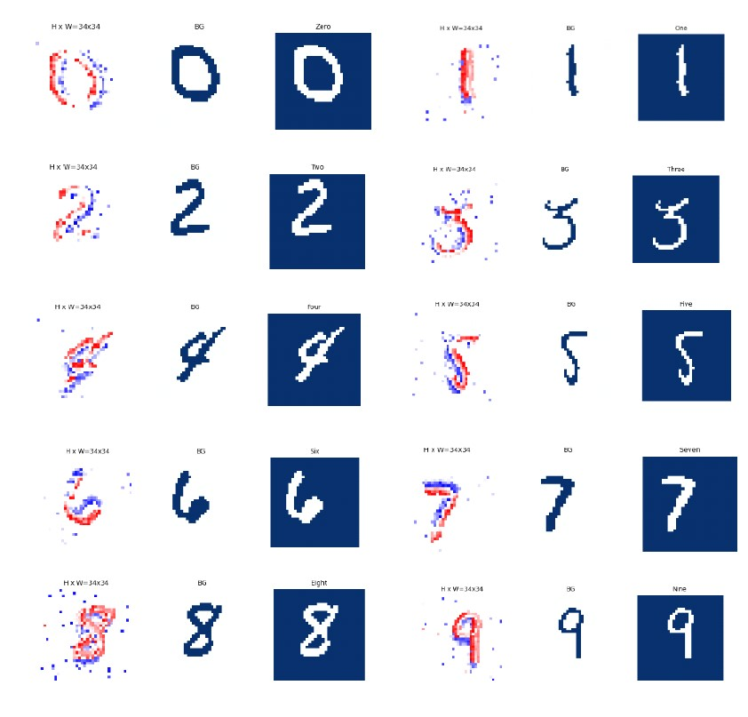
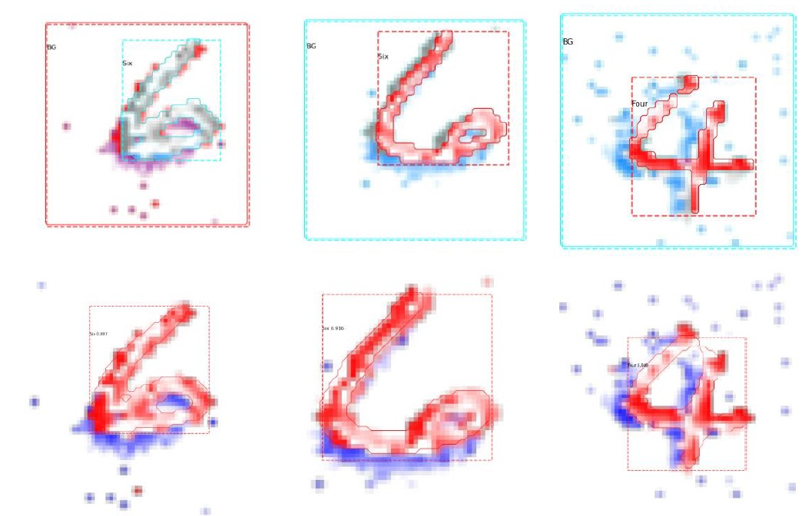

# Instance Segmentation

Instance segmentation in event-based videos (Research project). [Paper here](https://www.overleaf.com/read/cdgfmcgsjkpp).

For this project we are currently using: Python 3.8.12, Miniconda3 and Pytorch. This is because it should be compatible with [HPC](https://gitlab.tudelft.nl/pattern-recognition-and-bioinformatics/wiki/-/wikis/HPC-quickstart-guide) so we can make use of training the models on it.

Required background knowledge:
- What is an event-based camera? [Link1](https://www.youtube.com/watch?v=MjX3z-6n3iA), [Link2](https://www.youtube.com/watch?v=6xOmo7Ikwzk&ab_channel=Sony)
- Basic Machine Learning (ML) knowledge and what is a neural network (NN)? [3b1b playlist](https://www.youtube.com/playlist?list=PLZHQObOWTQDNU6R1_67000Dx_ZCJB-3pi)
- Basic Pytorch knowledge. [60min tutorial](https://pytorch.org/tutorials/beginner/deep_learning_60min_blitz.html)
- Image Processing and Computational Intelligence knowledge from courses like CSE2225 and CSE2530.

## Setting up Miniconda (for Windows only)

Make a Virtual environment with Miniconda3 by following this [youtube tutorial](https://www.youtube.com/watch?v=1gtHso20YMQ&ab_channel=CharlBotha).

In miniconda command line:
```
conda create --name instance_segmentation python=3.8.12  
conda info --envs  
conda activate instance_segmentation  
```

Hopefully just running the following command should work:
```
pip install -r requirements.txt
```

<details>
  <summary>Otherwise check this section!</summary>
  


For Pytorch
```
conda install astunparse numpy ninja pyyaml mkl mkl-include setuptools cmake cffi typing_extensions future six requests dataclasses
conda install -c conda-forge libuv=1.39
pip3 install torch==1.8.1+cpu torchvision==0.9.1+cpu torchaudio===0.8.1 -f https://download.pytorch.org/whl/torch_stable.html
```


Data visualization:  
```
pip install tonic
pip install matplotlib
```

OpenCV:
```
python3.8 -m pip install opencv-python
```

```
pip install scikit-image
```

[comment]: <> (pip freeze > requirements.txt)
</details>

<details>
  <summary>If Mask R-CNN is acting up read this!</summary>

[Working fork of Mask R-CNN TF2](https://github.com/alsombra/Mask_RCNN-TF2) - working as of May 2022
[Official Mask R-CNN](https://github.com/matterport/Mask_RCNN) - was not working with installed setup

For h5py:
```
pip uninstall h5py
conda install -c anaconda h5py
```

For imgaug:
```
pip3 install imgaug
```

For pycocotools:
```
pip install cython
pip install git+https://github.com/philferriere/cocoapi.git#egg=pycocotools^&subdirectory=PythonAPI
```

For scipy:
```
pip install -U scikit-image==0.16.2
```

</details>


## Visuals
Generated training masks  


[//]: # (GIF with training masks overlayed?)

Predictions


## Roadmap
W1 starting on 19/04/2022, presentation on 22/06/2022, documented [here](https://www.overleaf.com/read/dmgtfpdqtxrr).

## Authors and acknowledgment
Author: Ana Băltărețu  
Supervisors: Nergis Tömen, Ombretta Strafforello, Xin Liu

## Relevant Papers
1. [Event-based Vision: A Survey](https://arxiv.org/pdf/1904.08405.pdf)
2. ...

## Other resources
1. ...
2. ...

## License
MIT License
Copyright (c) 2022 Ana Băltăreţu

